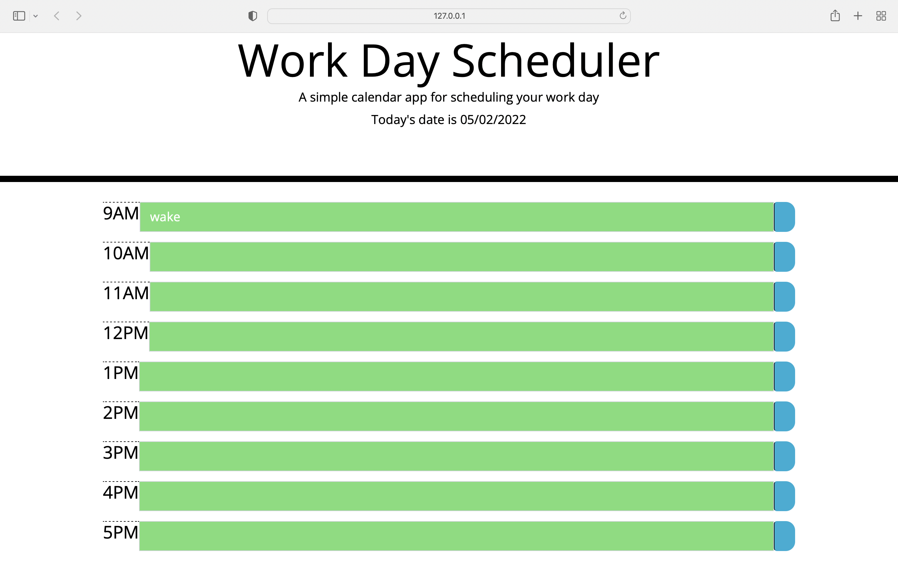

# Work-Time/Work-Day-Planner

## My motivation behind this project was to make an day planner that had the current date on it as well as being able to track your saved items throughout the day without having to keep it open.

## [Installation] In order to install my program: Step1-create a new directory on local computer. Step2-Go to my GitHub profile @Bvatuvei. Step3-Go to my repositories and select "Work-Time". Step4-Click on code and then copy ssh or https. Step5- Open terminal and type "git clone <"your previously copied ssh/https">.

## [link] [code-link]https://github.com/Bvatuvei/Work-Time, [website-link]https://bvatuvei.github.io/Work-Time/

## Screenshot
